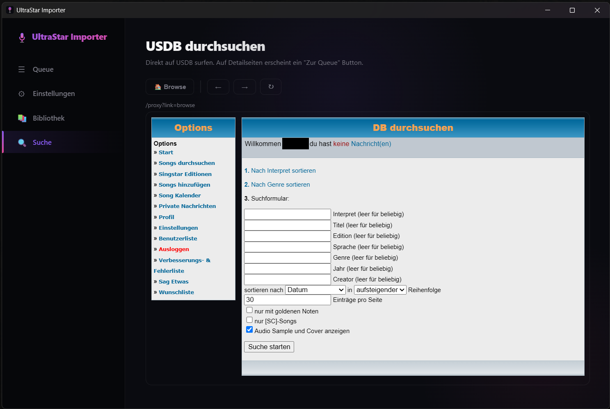
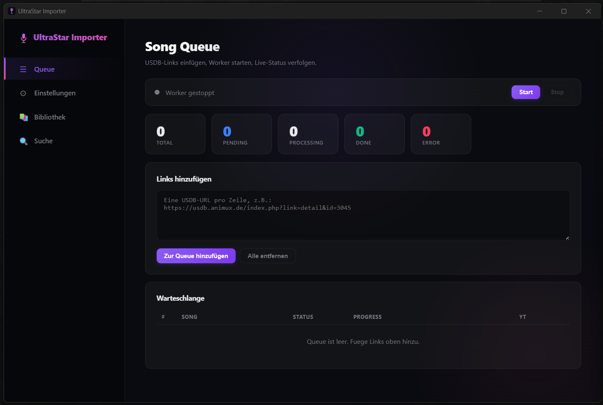
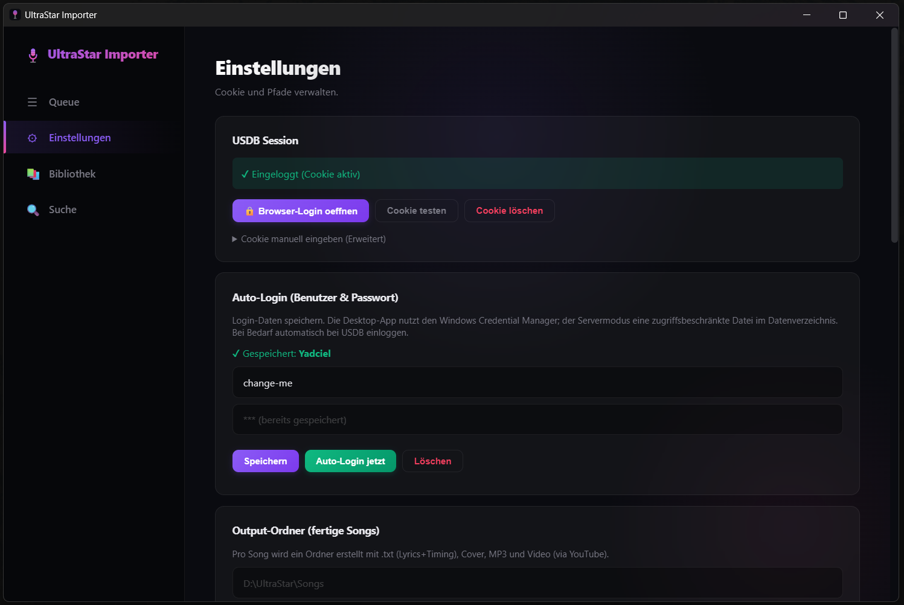

**English** | [Deutsch](README.de.md)

# UltraStar Importer


A local, open source importer for UltraStar songs from
[USDB](https://usdb.animux.de/). It downloads song metadata and UltraStar TXT
files, finds matching media on YouTube, and creates complete song folders that
work on local disks and network shares.

> [!WARNING]
> **Use at your own risk:** Only download and use content when you have the right
> to do so. This project does not include media, grant rights to third-party
> content, or accept liability for data loss, account suspension, or copyright
> infringement. Read the full [disclaimer and usage notice](DISCLAIMER.md).

UltraStar Importer is an **independent, unofficial project**. It is not affiliated
with USDB, Animux, YouTube, Google, or UltraStar Deluxe.

## Status

The current public target release is **0.1.0 (Beta)**. Automated tests cover the
main workflow, but changes to USDB or YouTube can still break individual
features. Back up the destination folder before running a large import.

## Features

- **USDB import:** metadata, UltraStar TXT files, and cover art
- **YouTube media:** search and audio/video downloads through yt-dlp
- **Quality controls:** audio format and bitrate, video format and maximum resolution
- **Post-processing:** EBU R128 loudness normalization and audio tags
- **Cover processing:** size limits, rotation, and automatic contrast correction
- **Library tools:** scan existing song folders and repair missing assets
- **Queue:** sequential or parallel processing with live progress
- **Security:** OS credential storage, same-origin checks, proxy sanitizing,
  path boundaries, and atomic writes
- **NAS/SMB support:** transactional staging folders and SMB-safe moves
- **Two run modes:** native Windows app or authenticated Docker server

## Screenshots

### Browse USDB inside the app

The integrated, sanitized USDB view lets you search without switching between
the app and a browser. Song detail pages can be added directly to the queue.



### Manage imports in the queue

Add multiple USDB links at once. Status cards and live progress show what each
import is doing.



### Configure the session and automatic login

The settings page handles browser login, saved login details, and the output
folder. Secrets are kept out of the regular project configuration.



A completed song folder looks like this:

```text
Songs/
└── Artist - Title/
    ├── Artist - Title.txt
    ├── Artist - Title.mp3
    ├── Artist - Title.mp4
    ├── Artist - Title [CO].jpg
    └── _links
```

`_links` intentionally has no `.txt` extension because UltraStar treats every
TXT file in a song folder as a song definition.

## Requirements

### Windows desktop

- Windows 10 or newer
- Microsoft Edge WebView2 Runtime
- [FFmpeg](https://ffmpeg.org/download.html) available on `PATH`

The release EXE includes Python and its Python dependencies, **but it does not
include an FFmpeg binary**.

### Running from source

- Python 3.12
- FFmpeg available on `PATH`
- Git

## Install from source

Download or clone the repository from GitHub, then open the project directory:

```bash
cd ultrastar-importer
python -m venv .venv
```

Windows:

```bash
.venv\Scripts\python -m pip install -r requirements.txt
.venv\Scripts\python main.py
```

Linux and macOS can run the headless server. This project packages the pywebview
desktop app for Windows only.

## Use the desktop app

1. Open **Settings → Browser login** and sign in to USDB.
2. Select an output folder.
3. Add USDB detail URLs or numeric song IDs to the queue.
4. Choose the audio/video quality and worker count.
5. Start the queue and follow the progress.
6. Check or repair the results from the **Library** tab.

On Windows, UltraStar Importer stores the USDB session and optional login details
in the Windows Credential Manager. The regular `config.json` contains no cookies
or passwords.

## Docker / headless server

> [!CAUTION]
> The server is intended for local or controlled private use.
> **Do not forward its port directly to the internet.** HTTP Basic Auth does not
> encrypt credentials. Outside the local machine, run the server behind a
> correctly configured HTTPS reverse proxy.

Create the configuration and writable host directories:

```bash
cp .env.example .env
mkdir -p data output
```

Replace `USDB_USERNAME` and `USDB_PASSWORD` in `.env` with your own strong values,
then start the server:

```bash
docker compose up --build -d
```

The web interface is available at <http://127.0.0.1:5776>. `/health` is
intentionally available without authentication and returns only minimal status
information.

Persistent directories:

```text
./data    -> /app/data
./output  -> /app/output
```

By default, Compose binds the server to `127.0.0.1` only. Set
`USDB_BIND_ADDRESS=0.0.0.0` for LAN access only when a correctly configured HTTPS
reverse proxy protects the server.

### Docker Engine in WSL2

Docker Desktop is not required. To use a Docker Engine running in WSL2:

```bash
wsl.exe -d Ubuntu-24.04 -- bash -lc \
  'cd /mnt/d/PATH/TO/ultrastar-importer && docker compose up --build -d'
```

## Data and privacy

Desktop data is stored here by default:

```text
%LOCALAPPDATA%\UltraStarImporter
```

This directory may contain configuration, cache files, and logs. Completed songs
are stored in the selected output folder. Never upload the following to issues
or commits:

- cookies or credentials
- `config.json`, `server-secrets.json`, or `.env`
- logs containing personal data
- downloaded songs, covers, audio, or video files

## Security

- Local APIs that change state validate the request origin.
- Server mode requires HTTP Basic Auth; `/health` is the only exception.
- External USDB pages are sanitized and receive a CSP before display.
- File and ZIP operations validate canonical paths and size limits.
- Configuration, secrets, and cache files use atomic writes.
- Full or slow SSE clients are rate-limited and disconnected.
- Downloads use staging directories; incomplete imports are cleaned up.

Report security issues privately as described in [SECURITY.md](SECURITY.md).

## Architecture

```text
main.py                     Windows/pywebview entry point
server.py                   Docker/headless entry point
src/app.py                  Flask API, proxy, and SSE
src/worker.py               Queue and import pipeline
src/usdb.py                 USDB parsing and downloads
src/youtube.py              yt-dlp integration
src/songs.py                Song TXT files and transactional folders
src/config.py               Paths, configuration, and credentials
static/index.html           Local web interface
tests/                      Automated tests
```

## Development and tests

Install development dependencies:

```bash
.venv\Scripts\python -m pip install -r requirements-dev.txt
```

Run tests and syntax checks:

```bash
set PYTHONPATH=
.venv\Scripts\python -m pytest -q
.venv\Scripts\python -m compileall -q main.py server.py src usdb_importer.py
```

Build the Windows EXE:

```bash
.venv\Scripts\python -m PyInstaller --clean --noconfirm ultrastar-importer.spec
```

The build creates `dist/UltraStarImporter.exe`. CI enforces a 25 MiB size limit
and packages the EXE with the license, disclaimer, and third-party notices.

See [CONTRIBUTING.md](CONTRIBUTING.md) and
[docs/RELEASING.md](docs/RELEASING.md) for more details.

## Known limitations

- USDB and YouTube do not provide stable APIs controlled by this project. Site
  changes may temporarily break parsers or login.
- Stopping the queue may wait for an active external yt-dlp or FFmpeg operation.
- The Docker server does not provide TLS.
- The application cannot automatically determine whether downloaded media may be
  used legally.

## License

Copyright © 2026 UltraStar Importer contributors.

This project is free software licensed under the
[GNU General Public License Version 3 only (GPL-3.0-only)](LICENSE). You may use,
modify, and redistribute it under those terms. Distribution of binaries or
modified versions must comply with the GPL and provide the corresponding source
code as required by the license.

The software comes **without any warranty** to the extent permitted by law.
Third-party components and their license texts are documented in
[THIRD_PARTY_NOTICES.md](THIRD_PARTY_NOTICES.md) and
[THIRD_PARTY_LICENSES.txt](THIRD_PARTY_LICENSES.txt).
